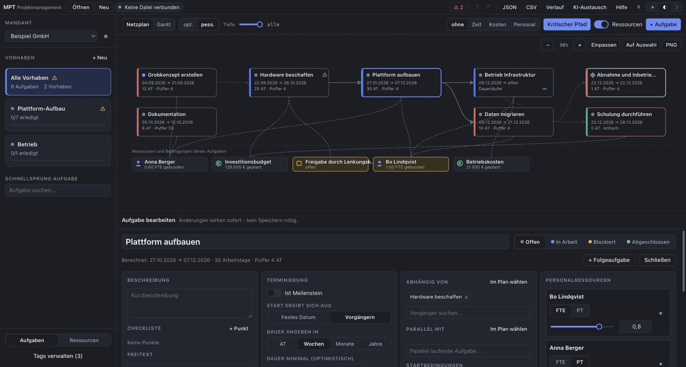
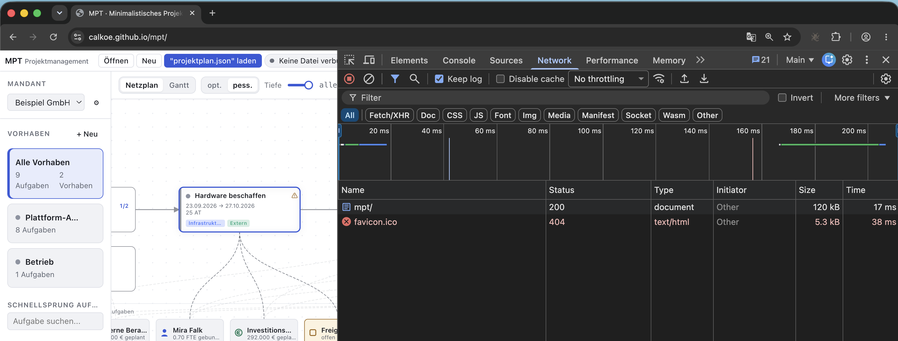
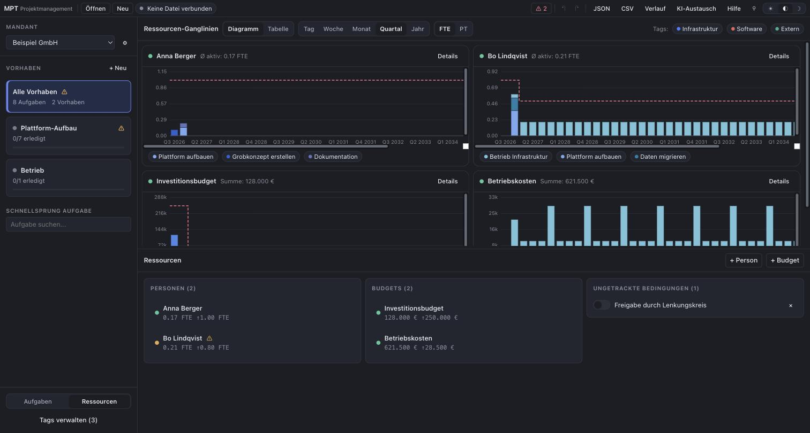

<div align="center">

# MPT

### Minimalistisches Projektmanagement-Tool

**Eine einzige HTML-Datei. Kein Backend. Deine Daten verlassen deinen Rechner nie.**

<br>

<a href="https://calkoe.github.io/mpt/"></a>

<sub>Öffnet die fertige Anwendung direkt – keine Installation, keine Anmeldung.<br>
Zum Mitnehmen: Seite speichern (<kbd>Strg</kbd>+<kbd>S</kbd>) – die Datei läuft danach auch offline per Doppelklick.</sub>

<br><br>

[](.github/workflows/build.yml)
[](src/engine/engine.test.ts)
[](#lizenz)
[](https://github.com/calkoe/mpt)

<br>



<sub>Aufgabenübersicht – zoombarer Netzplan mit hervorgehobenem kritischem Pfad, darunter die
angebundenen Ressourcen und Bedingungen, unten die Aufgabe zur Direktbearbeitung.</sub>

</div>

---

## Einfach. Und deine Daten bleiben deine.

**Einfachheit** eine Aufgabe anlegen kostet einen Klick,
verketten einen weiteren. Überall Auswahlfelder mit Autovervollständigung, Zahlen als Schieber,
Ja/Nein als Schalter. Was du eingibst, wirkt sofort – es gibt keinen Speichern-Knopf und keine
Formulare, die man erst absenden muss.

**Datenschutz durch Bauweise, nicht durch Versprechen.** MPT ist eine einzelne `index.html`, die
vollständig in deinem Browser läuft:

- **Kein Server, kein Konto, keine Cloud.** Es gibt nichts, wohin Daten übertragen werden könnten –
  die Anwendung enthält keinen einzigen Netzwerkaufruf.
- **Deine Datei, dein Ort.** Der gesamte Bestand liegt in einer lesbaren JSON-Datei, die du selbst
  auswählst: lokale Platte, verschlüsselter Container, Firmenlaufwerk. MPT schreibt genau dorthin
  zurück und sonst nirgendwohin.
- **Kein Tracking, keine Telemetrie, keine Schriften oder Skripte von fremden Servern.** Der Build
  wird in der CI darauf geprüft, dass er aus genau einer Datei ohne externe Referenzen besteht.
- **Funktioniert offline.** Netzwerkkabel ziehen ändert nichts.

Das lässt sich in zehn Sekunden selbst nachprüfen – Entwicklertools öffnen, Reiter „Netzwerk", die
Anwendung benutzen:

<div align="center">



<sub>Das ist der gesamte Netzwerkverkehr: <code>mpt/</code> – die Anwendung selbst, 120&nbsp;kB – und ein
fehlendes Favicon. Danach nichts mehr. Kein Analytics, keine Schriften, keine Telemetrie, kein
Speichern „nach Hause". Planen, tippen, Datei schreiben: die Liste bleibt leer.</sub>

</div>

Damit ist MPT auch dort einsetzbar, wo eine Cloud-Lösung nicht in Frage kommt: Personalplanung,
Budgets und Mandantendaten bleiben schlicht da, wo sie hingehören.

## Kernfunktionen

|                           |                                                                                                                      |
| ------------------------- | -------------------------------------------------------------------------------------------------------------------- |
| **Netzplan & Gantt**      | Automatisch gelayouteter Abhängigkeitsgraph, zoom- und verschiebbar, umschaltbar auf Balkenplan von Tag bis Jahr.    |
| **Kritischer Pfad**       | Klassische CPM-Berechnung inkl. Gesamtpuffer je Aufgabe – auf Knopfdruck hervorgehoben.                              |
| **Verketten per Klick**   | Beim Überfahren einer Aufgabe erscheint links und rechts ein grünes „+" für Vorgänger bzw. Nachfolger.               |
| **Dauer als Spanne**      | Aufgaben dauern „4 bis 7 Tage". Ein Umschalter rechnet den ganzen Plan optimistisch oder pessimistisch.              |
| **Dauerläufer**           | Aufgaben ohne Enddatum wie „Betrieb Infrastruktur X" – laufen zehn Jahre weiter und bleichen im Gantt aus.           |
| **Meilensteine**          | Im Netzplan als Raute hervorgehoben, im Gantt als senkrechte Linie am Enddatum.                                      |
| **Ressourcen-Ganglinien** | Auslastung aller Personen (FTE/PT) und Budgets (€), als gestapelte Balken je verursachender Aufgabe.                 |
| **Warnzentrum**           | Alle Hinweise an einer Stelle: überfällige Aufgaben, offene Bedingungen, Personen und Budgets ab 90 % Auslastung.    |
| **Parallelität**          | „Solange A läuft, müssen B und C laufen" – wird geprüft und gemeldet, ohne Termine zu verschieben.                   |
| **Versionierung**         | Automatische Checkpoints (max. alle 10 Min, die letzten 50) plus sofortiges Undo/Redo per `Strg+Z`.                  |
| **Auswertung**            | Klick auf einen Zeitraum oder Knopfdruck unter einer Liste: Tabelle aller Einzelpositionen, in Excel kopierbar. |
| **Notizen im Netzplan**   | Freie Kacheln auf der Fläche – direkt beschreibbar, frei verschiebbar; leer geschrieben heißt gelöscht.              |
| **Zwei Fenster**          | Aufgaben und Ressourcen gleichzeitig auf zwei Bildschirmen – dieselbe Sitzung, dieselbe Datei, kein Abgleich.        |
| **Export**                | Netzplan, Gantt und Ganglinien als PNG, der gesamte Bestand als CSV für Excel – ohne Umweg über einen Dienst.       |
| **KI-Austausch**          | Exportiert den Bestand als Markdown mit Schema-Anleitung für ein LLM; der Import zeigt vor der Übernahme einen Diff. |
| **Gemeinsame Ablage**     | Sperrvermerk in der Datei, damit auf SharePoint & Co. niemand versehentlich gleichzeitig schreibt.                   |
| **Tastaturbedienung**     | Vollständig per Tab und Pfeiltasten bedienbar, mit Command-Palette auf `Strg+K`.                                     |
| **Hell & Dunkel**         | Beide Themes vollständig durchgestaltet, folgt auf Wunsch der Systemeinstellung.                                     |

<div align="center">



<sub>Ressourcenübersicht – gestapelte Ganglinien je Person und Budget mit Grenzwertlinie,
Tag-Filter und den Listen darunter.</sub>

</div>

## Selbst bauen

```bash
npm install
npm run dev       # Entwicklungsserver
npm test          # Engine-, Migrations-, Sperr- und Exporttests
npm run build     # erzeugt dist/index.html – die fertige Anwendung
```

Die gebaute `dist/index.html` lässt sich per Doppelklick öffnen, auf einen beliebigen Webserver
legen oder per E-Mail verschicken. Sie funktioniert ohne Internetverbindung.

### Version und Veröffentlichung

Die Version steht an **genau einer Stelle**: `version` in `package.json`. Der Build spritzt sie in
die Anwendung ein, die sie klein unten rechts anzeigt.

```bash
# Version in package.json anheben, committen, dann:
git tag v1.6.0 && git push origin v1.6.0
```

Veröffentlicht wird ausschließlich über solche Tags. Die CI prüft, dass der Tag die Form `vN.N.N`
hat, auf `main` sitzt, zur Version in `package.json` passt und höher ist als der letzte Tag – erst
dann landet die gebaute Datei in GitHub Pages und im Release. `dist/` steht in `.gitignore`; die
öffentlich abrufbare `index.html` kann damit nur aus einem sauberen, versionierten Lauf stammen.

## Bedienung in 60 Sekunden

Beim ersten Start erscheint eine bebilderte Kurzanleitung; sie lässt sich jederzeit über **Hilfe**
in der Kopfzeile erneut öffnen.

1. **Öffnen** wählt eine bestehende JSON-Datei, **Neu** legt eine an. Ab dann speichert MPT automatisch
   in genau diese Datei – der Status oben zeigt jederzeit, ob alles geschrieben wurde.
2. Links ein **Vorhaben** anlegen. Vorhaben bündeln Aufgaben; das Dropdown darüber trennt **Mandanten**
   als vollständig unabhängige Datenräume.
3. **+ Aufgabe** anlegen. Start, Ende und Dauer sind ineinander umrechenbar – eines eingeben genügt.
   Eine Dauer von **0** heißt: kein Enddatum, die Aufgabe läuft dauerhaft weiter.
4. Zum **Verketten** im Netzplan über eine Aufgabe fahren und auf das grüne **+** an ihrer linken
   oder rechten Kante klicken – links entsteht ein Vorgänger, rechts eine Folgeaufgabe.
5. Personen, Budgets, Tags und Bedingungen entstehen **beim Tippen** – Namen eingeben, „neu anlegen" wählen.
6. Im Gantt lassen sich Aufgaben mit **festem Starttermin direkt ziehen**; Nachfolger wandern mit.
7. Unten links auf **Ressourcen** wechseln, um die Auslastung über die Zeit zu sehen.

### Tastaturkürzel

| Kürzel                  | Wirkung                  |     | Kürzel    | Wirkung                 |
| ----------------------- | ------------------------ | --- | --------- | ----------------------- |
| `Strg`+`K`              | Command-Palette          |     | `Alt`+`1` | Aufgaben · Netzplan     |
| `Strg`+`Z` / `Strg`+`Y` | Rückgängig / Wiederholen |     | `Alt`+`2` | Aufgaben · Gantt        |
| `Strg`+`S`              | Sofort speichern         |     | `Alt`+`3` | Ressourcen · Ganglinien |
| `Strg`+`O`              | Datei öffnen             |     | `Alt`+`4` | Ressourcen · Tabelle    |
| `Alt`+`N`               | Neue Aufgabe             |     | `Alt`+`G` | Netzplan ⇄ Gantt        |
| `Alt`+`V`               | Neues Vorhaben           |     | `Alt`+`W` | Warnzentrum             |
|                         |                          |     | `Alt`+`H` | Kurzanleitung           |

## Fachliches Modell

```
Mandant ─┬─ Vorhaben ──── Aufgaben
         ├─ Personen  (verfügbare FTE je Zeitraum)
         ├─ Budgets   (Obergrenzen je Zeitraum)
         ├─ Tags      (Farbe vergeben, zentral änderbar)
         └─ Bedingungen (erfüllt / nicht erfüllt)
```

Eine **Aufgabe** startet entweder zu einem festen Datum oder ergibt ihren Start aus den Vorgängern
(spätestes Ende + 1 Arbeitstag). Sie bindet **Personalressourcen** über Personentage oder FTE und
**Kosten** über einmalige oder wiederkehrende Beträge (alle _N_ Tage/Wochen/Monate/Quartale/Jahre).

Gerechnet wird in **Arbeitstagen (Mo–Fr)**, kleinste Einheit ist ein Kalendertag – keine Uhrzeiten.

## Datei, Sperre und Datensicherheit

- Der Datenbestand ist eine gewöhnliche, lesbare JSON-Datei. Kein proprietäres Format, kein Lock-in.
- Beim Laden einer Datei mit älterem Schema wird **automatisch migriert** und vorher eine
  **Sicherungskopie** `<name>.v<alt>.bak.json` daneben abgelegt.
- Fehlende Felder werden ergänzt, tote Verweise entfernt – eine beschädigte Datei führt nie zum Absturz.
- Schlägt ein Schreibvorgang fehl, wird das deutlich rot gemeldet und nicht stillschweigend verworfen.

### Gemeinsame Ablage (SharePoint, OneDrive, Netzlaufwerk)

Liegt die Datei an einem Ort, an den mehrere Leute herankommen, trägt MPT beim Öffnen einen
**Sperrvermerk in die Datei selbst** ein und frischt ihn regelmäßig auf.

- Ist die Datei bereits in Bearbeitung, wird sie **nur zum Lesen** verbunden und der Halter genannt.
- Bleibt das Lebenszeichen aus – Browser geschlossen, Rechner abgestürzt, Tab eingefroren – läuft die
  Sperre **nach drei Minuten von selbst ab** und wird beim nächsten Öffnen automatisch übernommen.
  Eine Datei kann dadurch nie dauerhaft blockiert bleiben.
- Übernimmt jemand anderes die Sperre, während du offen hast, schaltet MPT sofort auf Nur-Lesen und
  überschreibt seine Änderungen nicht.

### Wann das automatische Speichern funktioniert

Das Zurückschreiben nutzt die File System Access API. Die gibt es **nur in Chrome oder Edge am
Rechner** – und auch dort nur, wenn die Seite aus einem _sicheren Kontext_ kommt:

| Aufruf                                       | Automatisch speichern |
| -------------------------------------------- | --------------------- |
| `https://…` (z. B. GitHub Pages)             | ✅ ja                 |
| `http://localhost:…`                         | ✅ ja                 |
| `file://…` – die Datei per Doppelklick       | ❌ nein               |
| `http://192.168.…` – anderer Rechner im Netz | ❌ nein               |
| Safari, Firefox                              | ❌ nein               |

Das ist die häufigste Verwechslung: **Chrome kann es, die Seite darf es nur nicht.** Wer die gebaute
`index.html` doppelklickt, landet auf `file://` und bekommt deshalb keinen Dateizugriff – obwohl der
Browser stimmt.

MPT meldet den Fall direkt beim Start in einer Leiste unter der Kopfzeile und nennt dabei den
konkreten Grund. Die Anwendung läuft in jedem Fall vollständig; der Bestand lässt sich über _JSON_
herunterladen, automatisch gespeichert wird dann aber nichts.

Abhilfe für eine lokale Datei: über einen kleinen Webserver ausliefern statt doppelklicken, etwa
`npx serve dist` und dann `http://localhost:3000` öffnen.

## KI-Austausch

Über **KI-Austausch → Export** entsteht eine Markdown-Datei, die den vollständigen Datenbestand plus eine
Beschreibung des Schemas und der Regeln enthält. Diese an ein LLM geben („Verschiebe alle Aufgaben mit Tag
_Extern_ um zwei Wochen"), die Antwort im Reiter **Import** einfügen – vor der Übernahme zeigt MPT genau,
welche Objekte angelegt, geändert oder gelöscht werden. Auch das ist bewusst manuell: es geht nichts
automatisch irgendwohin.

## Entwicklung

Der Einstiegspunkt in den Code ist **[ARCHITEKTUR.md](ARCHITEKTUR.md)** – dort steht, welches Modul wofür
zuständig ist und welche Regeln bei Erweiterungen gelten. Die fachlichen Anforderungen und alle getroffenen
Entscheidungen stehen in **[agend.md](agend.md)**.

```
src/
  model/       Datenmodell, Migration, Factory
  engine/      Arbeitstage, CPM-Terminierung, Ressourcen, Layout, Validierung
  state/       Store mit Undo/Redo, Einstellungen, abgeleitete Daten
  persistence/ Dateizugriff, Sperre und Checkpoints
  export/      PNG der Visualisierungen, CSV des Datenbestands
  ai/          Export/Import und Diff
  ui/          Oberfläche (Design-System in ui/components)
```

CI baut bei jedem Push nach `main` die `index.html`, prüft Typen und Tests, stellt sicher, dass
`dist/` genau eine Datei ohne externe Referenzen enthält, und veröffentlicht das Ergebnis über
GitHub Pages – das ist die Datei hinter dem Startknopf oben.

## Lizenz

MIT
